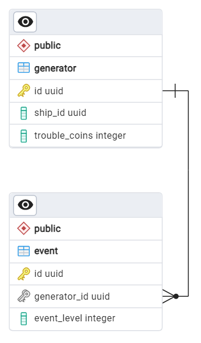

# Микросервис генератора событий

## Задачи

- Хранит и управляет информацией о генераторах и их событиях.
- Consumer сообщений «новый день» (от игрового контроллера).
- Producer сообщений «событие».

## Deploy

### Переменные окружения

| Имя переменной                | Используемое значение | Описание                                                    |
|-------------------------------|-----------------------|-------------------------------------------------------------|
%TODO%

## Endpoints

### Healthcheck

Реализован стандартный endpoint для проверки работоспособности сервиса: `/health`.

### Методы WebAPI

%TODO%

## Схема БД

