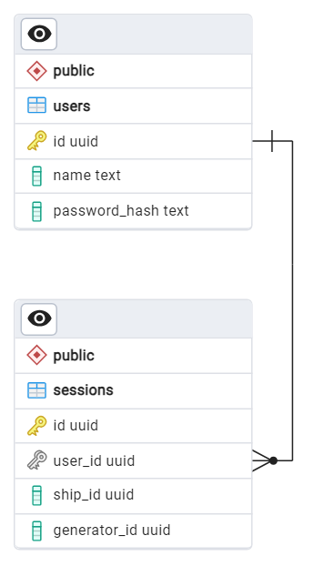

# Микросервис игрового контроллера

## Задачи

- Входная точка в приложение.
- Взаимодействие между сервисами.
- Аутентификация пользователей.
- Управление пользовательскими данными.
- Хранение информации об игровых сессиях.
- Publisher сообщений «новый день».

## Deploy

### Переменные окружения

| Имя переменной                     | Используемое значение | Описание                                                                                                                          |
|------------------------------------|-----------------------|-----------------------------------------------------------------------------------------------------------------------------------|
| ASPNETCORE_ENVIRONMENT             | Production            | Тип окружения развёрнутого приложения (Devlopment или Production).                                                                |
| ASPNETCORE_URLS                    | http://+:7196         | Список URL, на которых будет запущено приложение.                                                                                 |
| RABBITMQ__HOSTNAME                 | rabbitmq              | Имя хоста с RabbitMQ.                                                                                                             |
| RABBITMQ__PORT                     | 5672                  | Порта хоста с RabbitMQ.                                                                                                           |
| RABBITMQ__USERNAME                 | game-controller       | Имя пользователя для RabbitMQ.                                                                                                    |
| RABBITMQ__PASSWORD                 | Gc1234                | Пароль пользователя для RabbitMQ.                                                                                                 |
| RABBITMQ__VIRTUALHOST              | /                     | Имя virtual host на RabbitMQ.                                                                                                     |
| RABBITMQ__NEWDAYEXCHANGENAME       | x_new_day             | Имя exchange для событий "новый день" на RabbitMQ.                                                                                |
| RABBITMQ__NEWDAYQUEUENAMEGENERATOR | q_new_day_generator   | Имя очереди для событий "новый день" на RabbitMQ для EventGenerator. Должно совпадать со значением на стороне EventGenerator. |
| RABBITMQ__NEWDAYQUEUENAMESHIP      | q_new_day_ship        | Имя очереди для событий "новый день" на RabbitMQ для SpaceShip. Должно совпадать со значением на стороне SpaceShip.           |
| DATABASE_HOSTNAME                  | game_controller_db    | Имя хоста с базой данных.                                                                                                         |
| DATABASE_PORT                      | 5432                  | Порт хоста с базой данных.                                                                                                        |
| DATABASE_NAME                      | game_controller       | Имя базы данных.                                                                                                                  |
| DATABASE_USER                      | postgres              | Имя пользователя для базы данных.                                                                                                 |
| DATABASE_PASSWORD                  | pg_pass               | Пароль пользователя для базы данных.                                                                                              |
| SPACESHIPAPI__HOSTNAME             | spaceship_webapi      | Имя хоста со SpaceShip-сервисом.                                                                                                  |
| SPACESHIPAPI__PORT                 | 5216                  | Порт хоста со SpaceShip-сервисом.                                                                                                 |
| GENERATORAPI__HOSTNAME             | generator_webapi      | Имя хоста с EventGenerator-сервисом.                                                                                              |
| GENERATORAPI__PORT                 | 7161                  | Порт хоста с EventGenerator-сервисом.                                                                                             |
| JWT__KEY                           | MySuperSecretKeyForJwtTokenGeneration | Ключ, используемый для шифрования JWT.                                                                            |
| JWT__ISSUER                        | GameControllerAPI     | Уникальный идентификатор стороны, генерирующей JWT.                                                                               |
| JWT__AUDIENCE                      | GameControllerUsers   | Получатели сгенерированных JWT.                                                                                                   |
| JWT__EXPIRATIONMINUTES             | 1                     | Количество минут после момента генерации JWT, по прошествии которого JWT станет невалидным.                                       |

## Endpoints

### Healthcheck

Реализован стандартный endpoint для проверки работоспособности сервиса: `/health`.

### Методы WebAPI

%TODO%

## Схема БД

