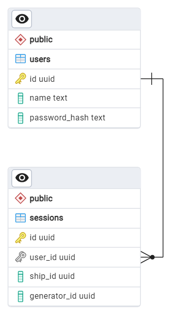

# Микросервис кораблей

## Задачи

- Хранит и управляет информацией о кораблях и их ресурсах.
- Consumer сообщений «новый день» (от игрового контроллера).
- Consumer сообщений «событие» (от генератора).

## Deploy

### Переменные окружения

| Имя переменной             | Используемое значение | Описание                                                           |
|----------------------------|-----------------------|--------------------------------------------------------------------|
| ASPNETCORE_ENVIRONMENT     | Production            | Тип окружения развёрнутого приложения (Devlopment или Production). |
| ASPNETCORE_URLS            | http://+:5216         | Список URL, на которых будет запущено приложение.                  |
| RABBITMQ_HOST              | rabbitmq              | Адрес хоста брокера сообщений RabbitMQ.                            |
| RABBITMQ_USER              | space-ship            | Имя пользователя для подключения к RabbitMQ.                       |
| RABBITMQ_PASSWORD          | Ss1234                | Пароль для подключения к RabbitMQ.                                 |
| RABBITMQ_TROUBLES_QUEUE    | q_troubles            | Имя очереди для сообщений от EventGenerator.                       |
| RABBITMQ_TROUBLES_EXCHANGE | x_troubles            | Exchange для привязки очереди сообщений от EventGenerator.         |
| RABBITMQ_STEP_QUEUE        | q_new_day_ship        | Очередь для сообщений о новом игровом дне.                         |
| RABBITMQ_STEP_EXCHANGE     | x_new_day             | Exchange для привязки очереди сообщений о новом игровом дне.       |
| POSTGRES_HOST              | game_controller_db    | Адрес хоста PostgreSQL.                                            |
| POSTGRES_PORT              | 5432                  | Порт для подключения к PostgreSQL.                                 |
| POSTGRES_DATABASE          | spaceship_db          | Имя БД PostgreSQL.                                                 |
| POSTGRES_USER              | postgres              | Имя пользователя для подключения к БД.                             |
| POSTGRES_PASSWORD          | pg_pass               | Пароль подключения к БД.                                           |

## Endpoints

### Healthcheck

Реализован стандартный endpoint для проверки работоспособности сервиса: `/health`.

### Методы WebAPI

- POST `/api/v1/spaceships` &mdash; создать новый корабль
- GET `/api/v1/spaceships/{id}` &mdash; получить состояние корабля и его ресурсов

### SignalR Hub

Уведомления об изменении состояния корабля доступны по подписке через SignalR.

Хаб доступен по uri `/notification-hub`.

Методы:
- Subscribe &mdash; подписка на корабль по id.
- Unsubscribe &mdash; отписка от корабля по id.
- Refresh &mdash; получение обновлённой модели корабля.

## Схема БД

