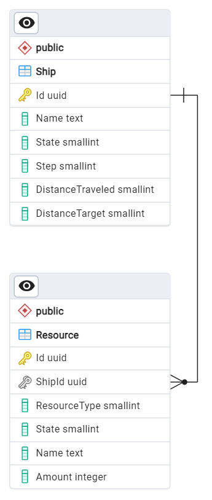

# Микросервис кораблей

## Задачи
- Хранит и управляет информацией о кораблях и их ресурсах
- Consumer сообщений «новый день» (от игрового контроллера)
- Consumer сообщений «событие» (от генератора)

## Переменные окружения
| Имя переменной                | Значение по-умолчанию | Описание                                      |
|-------------------------------|-----------------------|-----------------------------------------------|
| RABBITMQ_HOST                 | rabbitmq              | Адрес хоста брокера сообщений RabbitMQ        |
| RABBITMQ_USER                 | space-ship            | Имя пользователя для подключения к RabbitMQ   |
| RABBITMQ_PASSWORD             |                       | Пароль для подключения к RabbitMQ             |
| RABBITMQ_TROUBLES_QUEUE       | q_troubles            | Имя очереди для сообщений от EventGenerator   |
| RABBITMQ_TROUBLES_EXCHANGE    | x_troubles            | Exchange для привязки очереди EventGenerator  |             |
| RABBITMQ_STEP_QUEUE           | q_new_day_ship        | Очередь для сообщений о новом игровом дне     |
| RABBITMQ_STEP_EXCHANGE        | x_new_day             | Exchange для привязки очереди сообщений о новом игровом дне   |
| POSTGRES_HOST                 |                       | Адрес хоста СУБД PostgreSQL                   |
| POSTGRES_PORT                 | 5432                  | Порт для подключения к PostgreSQL             |
| POSTGRES_USER                 | postgres              | Имя пользователя для подключения к СУБД       |
| POSTGRES_PASSWORD             |                       | Пароль кодключения к СУБД                     |

## Схема БД

## Helthcheck
Реализован стандартный endpoint для проверки работоспособности сервиса
/health

## Методы WebAPI
- POST /api/v1/spaceships - создать новый корабль
- GET api/v1/spaceships/{id} - получить состояние корабля и его ресурсов.

## SignalR Hub
Уведомления о измении состония корабля доступны по подписке через SignalR
Хаб доступен по uri /notification-hub
Методы:
- Subscribe - подписка на корабль по id
- SubscribeMany - подписка на список кораблей (массив id)
